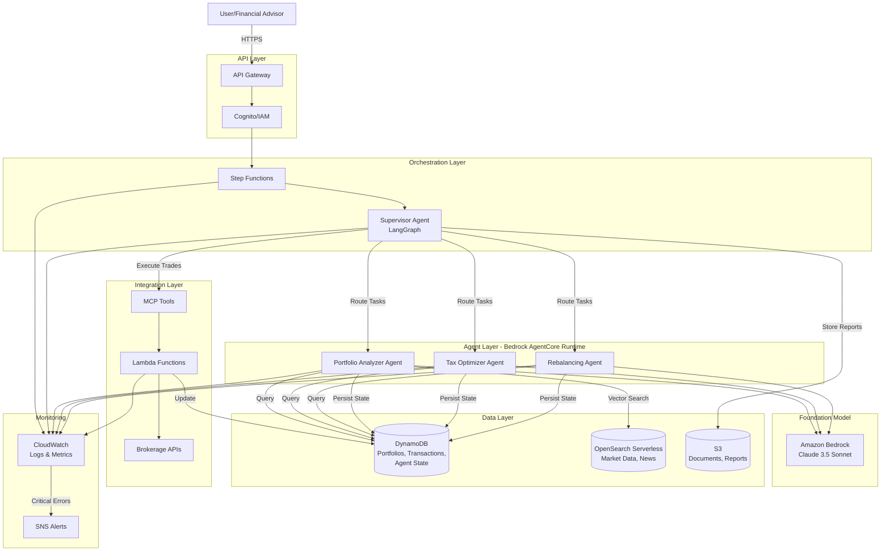
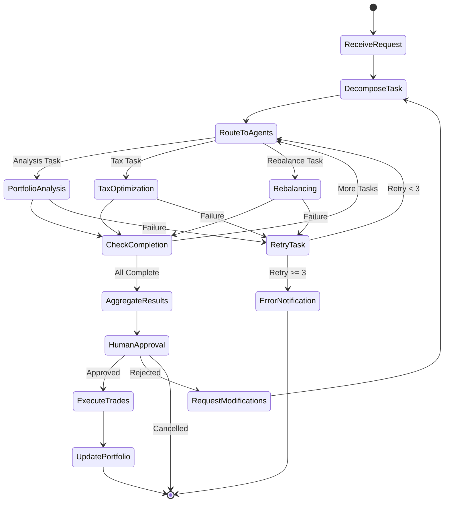
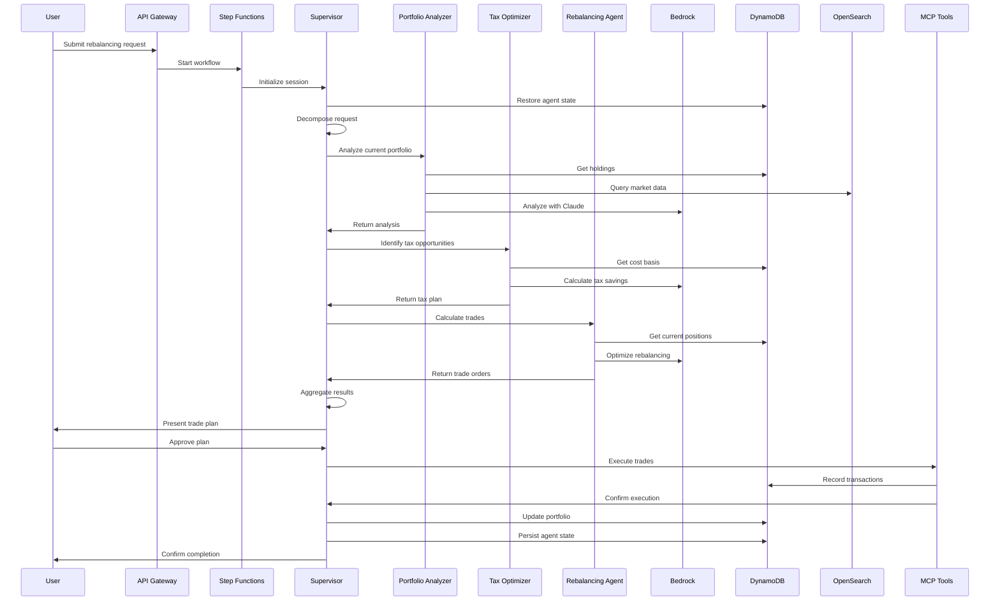
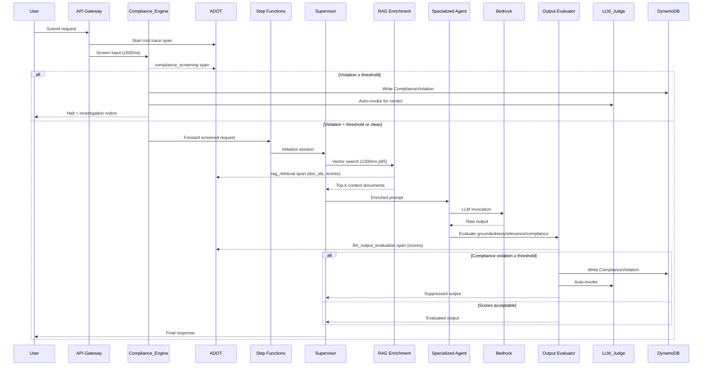
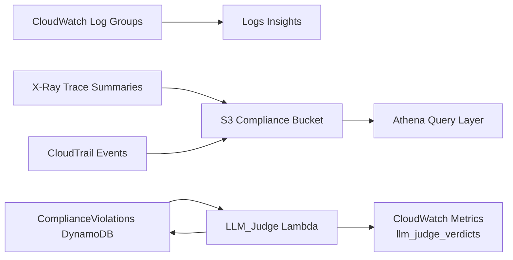

# Technical Design Document

## Overview

The Multi-Agent Advisory AI System is a serverless, AI-powered portfolio management platform built on AWS infrastructure. The system employs a supervisor-agent architecture where a LangGraph-based Supervisor Agent orchestrates three specialized agents (Portfolio Analyzer, Tax Optimizer, and Rebalancing Agent) to provide comprehensive portfolio management services.

The architecture leverages AWS Bedrock for foundation model access (Claude 3.5 Sonnet), AgentCore Runtime for agent lifecycle management, DynamoDB for data persistence, OpenSearch Serverless for vector-based market data retrieval, Step Functions for workflow orchestration, and Lambda for serverless compute. The Model Context Protocol (MCP) provides standardized tool connectivity between agents and backend services.

Key capabilities include:
- Real-time portfolio analysis with performance and risk metrics
- Tax-loss harvesting opportunity identification
- Automated rebalancing calculations with transaction cost optimization
- Human-in-the-loop approval workflow for trade execution
- Persistent agent state across sessions for personalized advice
- Auto-scaling agent infrastructure with zero-to-scale capability
- Comprehensive security with IAM/Cognito authentication and encryption

## Architecture

### High-Level System Architecture





### LangGraph State Machine for Agent Orchestration

The Supervisor Agent uses LangGraph to manage the state flow between specialized agents. The state machine coordinates task decomposition, agent routing, result aggregation, and human approval.



### Component Interaction Flow




## Components and Interfaces

### 1. Supervisor Agent (LangGraph-based)

**Responsibilities:**
- Receive and parse user requests
- Decompose complex queries into subtasks
- Route subtasks to specialized agents
- Manage LangGraph state transitions
- Aggregate results from multiple agents
- Coordinate human-in-the-loop approval
- Handle retry logic for failed subtasks

**Interfaces:**


```python
# Input Interface
class SupervisorRequest:
    user_id: str
    session_id: str
    request_type: str  # "analyze", "rebalance", "tax_optimize"
    parameters: dict
    context: dict

# Output Interface
class SupervisorResponse:
    session_id: str
    status: str  # "success", "pending_approval", "error"
    results: dict
    requires_approval: bool
    approval_payload: Optional[ApprovalPayload]
    error_details: Optional[ErrorDetails]

# LangGraph State
class AgentState:
    user_id: str
    session_id: str
    original_request: SupervisorRequest
    subtasks: List[Subtask]
    completed_tasks: List[CompletedTask]
    pending_tasks: List[Subtask]
    aggregated_results: dict
    retry_counts: dict
    approval_status: Optional[str]
```

### 2. Portfolio Analyzer Agent

**Responsibilities:**
- Retrieve current portfolio holdings from DynamoDB
- Calculate performance metrics (total return, risk exposure, Sharpe ratio)
- Identify allocation drift from target allocation
- Query OpenSearch for relevant market data and news
- Generate structured analysis reports

**Interfaces:**

```python
# Input Interface
class AnalysisRequest:
    user_id: str
    portfolio_id: str
    analysis_type: str  # "performance", "risk", "drift"
    time_period: str  # "1D", "1W", "1M", "1Y", "YTD"

# Output Interface
class AnalysisReport:
    portfolio_id: str
    timestamp: datetime
    performance_metrics: PerformanceMetrics
    risk_metrics: RiskMetrics
    allocation_drift: AllocationDrift
    market_context: List[MarketInsight]
    recommendations: List[str]

class PerformanceMetrics:
    total_return: float
    annualized_return: float
    sharpe_ratio: float
    max_drawdown: float

class RiskMetrics:
    portfolio_volatility: float
    beta: float
    var_95: float  # Value at Risk
    concentration_risk: dict

class AllocationDrift:
    current_allocation: dict  # {asset_class: percentage}
    target_allocation: dict
    drift_percentage: dict
    rebalancing_needed: bool
```

### 3. Tax Optimizer Agent

**Responsibilities:**
- Retrieve cost basis information from DynamoDB
- Identify securities with unrealized losses
- Calculate potential tax savings from tax-loss harvesting
- Propose tax-optimized allocation adjustments
- Consider wash sale rules and holding periods

**Interfaces:**


```python
# Input Interface
class TaxOptimizationRequest:
    user_id: str
    portfolio_id: str
    current_holdings: List[Holding]
    target_allocation: dict
    tax_year: int

# Output Interface
class TaxOptimizationPlan:
    portfolio_id: str
    timestamp: datetime
    tax_loss_opportunities: List[TaxLossOpportunity]
    total_potential_savings: float
    recommended_trades: List[TaxOptimizedTrade]
    wash_sale_warnings: List[WashSaleWarning]

class TaxLossOpportunity:
    ticker: str
    quantity: int
    cost_basis: float
    current_value: float
    unrealized_loss: float
    potential_tax_savings: float
    replacement_security: Optional[str]

class TaxOptimizedTrade:
    action: str  # "sell", "buy"
    ticker: str
    quantity: int
    reason: str
    tax_impact: float
```

### 4. Rebalancing Agent

**Responsibilities:**
- Calculate difference between current and target allocations
- Generate specific buy, sell, and hold orders
- Optimize for transaction costs and tax efficiency
- Respect user-defined risk tolerances and constraints
- Minimize number of trades while achieving target allocation

**Interfaces:**

```python
# Input Interface
class RebalancingRequest:
    user_id: str
    portfolio_id: str
    current_holdings: List[Holding]
    target_allocation: dict
    constraints: RebalancingConstraints

class RebalancingConstraints:
    max_transaction_cost: float
    min_trade_size: float
    risk_tolerance: str  # "conservative", "moderate", "aggressive"
    excluded_securities: List[str]

# Output Interface
class RebalancingPlan:
    portfolio_id: str
    timestamp: datetime
    trade_orders: List[TradeOrder]
    expected_costs: TransactionCosts
    projected_allocation: dict
    risk_impact: RiskImpact

class TradeOrder:
    order_id: str
    action: str  # "buy", "sell", "hold"
    ticker: str
    quantity: int
    order_type: str  # "market", "limit"
    estimated_price: float
    estimated_cost: float

class TransactionCosts:
    total_commission: float
    estimated_slippage: float
    total_cost: float
```

### 5. MCP Tools

The Model Context Protocol provides standardized tool interfaces for agents to interact with backend services.

**Tool Definitions:**


```python
# MCP Tool: Portfolio Data Retrieval
class GetPortfolioTool:
    name: str = "get_portfolio"
    description: str = "Retrieve portfolio holdings and metadata"
    
    def execute(self, user_id: str, portfolio_id: str) -> Portfolio:
        # Query DynamoDB for portfolio data
        pass

# MCP Tool: Market Data Query
class QueryMarketDataTool:
    name: str = "query_market_data"
    description: str = "Search market data and news using vector similarity"
    
    def execute(self, query: str, filters: dict) -> List[MarketData]:
        # Query OpenSearch Serverless with vector embeddings
        pass

# MCP Tool: Trade Execution
class ExecuteTradeTool:
    name: str = "execute_trade"
    description: str = "Execute a trade order through brokerage API"
    
    def execute(self, trade_order: TradeOrder) -> TradeConfirmation:
        # Invoke Lambda function to execute trade
        pass

# MCP Tool: Cost Basis Retrieval
class GetCostBasisTool:
    name: str = "get_cost_basis"
    description: str = "Retrieve cost basis information for securities"
    
    def execute(self, user_id: str, ticker: str) -> CostBasisInfo:
        # Query DynamoDB for cost basis data
        pass

# MCP Tool: Agent State Management
class ManageAgentStateTool:
    name: str = "manage_agent_state"
    description: str = "Save or retrieve agent session state"
    
    def save_state(self, session_id: str, state: dict) -> bool:
        # Persist state to Bedrock AgentCore Runtime
        pass
    
    def load_state(self, session_id: str) -> dict:
        # Retrieve state from Bedrock AgentCore Runtime
        pass
```

### 6. AWS Step Functions Workflow

The Step Functions workflow orchestrates the high-level portfolio management process with automatic retries and error handling.

**Workflow Definition:**

```json
{
  "Comment": "Portfolio Rebalancing Workflow",
  "StartAt": "InitializeSupervisor",
  "States": {
    "InitializeSupervisor": {
      "Type": "Task",
      "Resource": "arn:aws:lambda:REGION:ACCOUNT:function:supervisor-init",
      "Retry": [
        {
          "ErrorEquals": ["States.TaskFailed"],
          "IntervalSeconds": 2,
          "MaxAttempts": 3,
          "BackoffRate": 2.0
        }
      ],
      "Next": "AnalyzePortfolio"
    },
    "AnalyzePortfolio": {
      "Type": "Task",
      "Resource": "arn:aws:lambda:REGION:ACCOUNT:function:portfolio-analyzer",
      "TimeoutSeconds": 300,
      "Retry": [
        {
          "ErrorEquals": ["States.TaskFailed"],
          "IntervalSeconds": 2,
          "MaxAttempts": 3,
          "BackoffRate": 2.0
        }
      ],
      "Next": "OptimizeTaxes"
    },
    "OptimizeTaxes": {
      "Type": "Task",
      "Resource": "arn:aws:lambda:REGION:ACCOUNT:function:tax-optimizer",
      "TimeoutSeconds": 300,
      "Retry": [
        {
          "ErrorEquals": ["States.TaskFailed"],
          "IntervalSeconds": 2,
          "MaxAttempts": 3,
          "BackoffRate": 2.0
        }
      ],
      "Next": "CalculateRebalancing"
    },
    "CalculateRebalancing": {
      "Type": "Task",
      "Resource": "arn:aws:lambda:REGION:ACCOUNT:function:rebalancing-agent",
      "TimeoutSeconds": 300,
      "Retry": [
        {
          "ErrorEquals": ["States.TaskFailed"],
          "IntervalSeconds": 2,
          "MaxAttempts": 3,
          "BackoffRate": 2.0
        }
      ],
      "Next": "AggregateResults"
    },
    "AggregateResults": {
      "Type": "Task",
      "Resource": "arn:aws:lambda:REGION:ACCOUNT:function:supervisor-aggregate",
      "Next": "WaitForApproval"
    },
    "WaitForApproval": {
      "Type": "Task",
      "Resource": "arn:aws:states:::lambda:invoke.waitForTaskToken",
      "Parameters": {
        "FunctionName": "arn:aws:lambda:REGION:ACCOUNT:function:approval-handler",
        "Payload": {
          "token.$": "$$.Task.Token",
          "input.$": "$"
        }
      },
      "TimeoutSeconds": 86400,
      "Next": "CheckApprovalStatus"
    },
    "CheckApprovalStatus": {
      "Type": "Choice",
      "Choices": [
        {
          "Variable": "$.approval_status",
          "StringEquals": "approved",
          "Next": "ExecuteTrades"
        },
        {
          "Variable": "$.approval_status",
          "StringEquals": "rejected",
          "Next": "HandleRejection"
        }
      ],
      "Default": "WorkflowCancelled"
    },
    "ExecuteTrades": {
      "Type": "Map",
      "ItemsPath": "$.trade_orders",
      "Iterator": {
        "StartAt": "ExecuteSingleTrade",
        "States": {
          "ExecuteSingleTrade": {
            "Type": "Task",
            "Resource": "arn:aws:lambda:REGION:ACCOUNT:function:trade-executor",
            "Retry": [
              {
                "ErrorEquals": ["States.TaskFailed"],
                "IntervalSeconds": 5,
                "MaxAttempts": 3,
                "BackoffRate": 2.0
              }
            ],
            "Catch": [
              {
                "ErrorEquals": ["States.ALL"],
                "ResultPath": "$.error",
                "Next": "TradeFailure"
              }
            ],
            "End": true
          },
          "TradeFailure": {
            "Type": "Task",
            "Resource": "arn:aws:lambda:REGION:ACCOUNT:function:trade-failure-handler",
            "End": true
          }
        }
      },
      "Next": "UpdatePortfolio"
    },
    "UpdatePortfolio": {
      "Type": "Task",
      "Resource": "arn:aws:lambda:REGION:ACCOUNT:function:portfolio-updater",
      "Next": "WorkflowComplete"
    },
    "HandleRejection": {
      "Type": "Task",
      "Resource": "arn:aws:lambda:REGION:ACCOUNT:function:rejection-handler",
      "Next": "WorkflowComplete"
    },
    "WorkflowCancelled": {
      "Type": "Succeed"
    },
    "WorkflowComplete": {
      "Type": "Succeed"
    }
  }
}
```

## Data Models


### DynamoDB Tables

#### 1. Portfolios Table

**Purpose:** Store portfolio holdings and metadata

**Schema:**
```python
{
    "TableName": "Portfolios",
    "KeySchema": [
        {"AttributeName": "user_id", "KeyType": "HASH"},
        {"AttributeName": "portfolio_id", "KeyType": "RANGE"}
    ],
    "AttributeDefinitions": [
        {"AttributeName": "user_id", "AttributeType": "S"},
        {"AttributeName": "portfolio_id", "AttributeType": "S"}
    ],
    "BillingMode": "PAY_PER_REQUEST",
    "StreamSpecification": {
        "StreamEnabled": true,
        "StreamViewType": "NEW_AND_OLD_IMAGES"
    }
}
```

**Item Structure:**
```python
{
    "user_id": "user_123",
    "portfolio_id": "portfolio_456",
    "portfolio_name": "Retirement Account",
    "target_allocation": {
        "stocks": 0.60,
        "bonds": 0.30,
        "cash": 0.10
    },
    "holdings": [
        {
            "ticker": "VTI",
            "quantity": 100,
            "cost_basis": 200.50,
            "current_price": 220.75,
            "purchase_date": "2023-01-15T00:00:00Z"
        }
    ],
    "total_value": 150000.00,
    "risk_tolerance": "moderate",
    "created_at": "2024-01-01T00:00:00Z",
    "updated_at": "2024-01-15T10:30:00Z"
}
```

#### 2. Transactions Table

**Purpose:** Store transaction history for audit and tax reporting

**Schema:**
```python
{
    "TableName": "Transactions",
    "KeySchema": [
        {"AttributeName": "user_id", "KeyType": "HASH"},
        {"AttributeName": "timestamp", "KeyType": "RANGE"}
    ],
    "AttributeDefinitions": [
        {"AttributeName": "user_id", "AttributeType": "S"},
        {"AttributeName": "timestamp", "AttributeType": "S"},
        {"AttributeName": "portfolio_id", "AttributeType": "S"}
    ],
    "GlobalSecondaryIndexes": [
        {
            "IndexName": "PortfolioIndex",
            "KeySchema": [
                {"AttributeName": "portfolio_id", "KeyType": "HASH"},
                {"AttributeName": "timestamp", "KeyType": "RANGE"}
            ],
            "Projection": {"ProjectionType": "ALL"}
        }
    ],
    "BillingMode": "PAY_PER_REQUEST"
}
```

**Item Structure:**
```python
{
    "user_id": "user_123",
    "timestamp": "2024-01-15T14:30:00Z",
    "transaction_id": "txn_789",
    "portfolio_id": "portfolio_456",
    "action": "buy",
    "ticker": "VTI",
    "quantity": 10,
    "price": 220.75,
    "commission": 0.00,
    "total_cost": 2207.50,
    "execution_status": "completed",
    "order_type": "market",
    "initiated_by": "rebalancing_agent"
}
```

#### 3. AgentSessions Table

**Purpose:** Store agent state and session context

**Schema:**
```python
{
    "TableName": "AgentSessions",
    "KeySchema": [
        {"AttributeName": "session_id", "KeyType": "HASH"}
    ],
    "AttributeDefinitions": [
        {"AttributeName": "session_id", "AttributeType": "S"},
        {"AttributeName": "user_id", "AttributeType": "S"}
    ],
    "GlobalSecondaryIndexes": [
        {
            "IndexName": "UserIndex",
            "KeySchema": [
                {"AttributeName": "user_id", "KeyType": "HASH"}
            ],
            "Projection": {"ProjectionType": "ALL"}
        }
    ],
    "BillingMode": "PAY_PER_REQUEST",
    "TimeToLiveSpecification": {
        "Enabled": true,
        "AttributeName": "ttl"
    }
}
```

**Item Structure:**
```python
{
    "session_id": "session_abc123",
    "user_id": "user_123",
    "agent_type": "supervisor",
    "state": {
        "current_step": "waiting_approval",
        "subtasks_completed": ["portfolio_analysis", "tax_optimization"],
        "pending_subtasks": ["rebalancing"],
        "conversation_history": [],
        "user_preferences": {}
    },
    "created_at": "2024-01-15T14:00:00Z",
    "last_updated": "2024-01-15T14:30:00Z",
    "ttl": 1705334400
}
```

#### 4. MarketDataCache Table

**Purpose:** Cache frequently accessed market data with TTL

**Schema:**
```python
{
    "TableName": "MarketDataCache",
    "KeySchema": [
        {"AttributeName": "data_key", "KeyType": "HASH"}
    ],
    "AttributeDefinitions": [
        {"AttributeName": "data_key", "AttributeType": "S"}
    ],
    "BillingMode": "PAY_PER_REQUEST",
    "TimeToLiveSpecification": {
        "Enabled": true,
        "AttributeName": "ttl"
    }
}
```

**Item Structure:**
```python
{
    "data_key": "price:VTI",
    "data_type": "price",
    "ticker": "VTI",
    "value": 220.75,
    "timestamp": "2024-01-15T14:30:00Z",
    "ttl": 1705334700,  # 5 minutes from timestamp
    "source": "market_data_api"
}
```

### OpenSearch Serverless Collection

**Purpose:** Vector-based search for market data, news, and regulatory documents

**Collection Configuration:**
```python
{
    "name": "market-intelligence",
    "type": "VECTORSEARCH",
    "description": "Market data and news for portfolio analysis"
}
```

**Index Mapping:**
```json
{
  "settings": {
    "index": {
      "knn": true,
      "knn.algo_param.ef_search": 512
    }
  },
  "mappings": {
    "properties": {
      "document_id": {"type": "keyword"},
      "document_type": {"type": "keyword"},
      "title": {"type": "text"},
      "content": {"type": "text"},
      "embedding": {
        "type": "knn_vector",
        "dimension": 1536,
        "method": {
          "name": "hnsw",
          "space_type": "cosinesimil",
          "engine": "nmslib"
        }
      },
      "ticker": {"type": "keyword"},
      "sector": {"type": "keyword"},
      "timestamp": {"type": "date"},
      "source": {"type": "keyword"},
      "metadata": {"type": "object"}
    }
  }
}
```

**Document Structure:**
```python
{
    "document_id": "news_12345",
    "document_type": "market_news",
    "title": "Tech Sector Rally Continues",
    "content": "Technology stocks extended gains...",
    "embedding": [0.123, -0.456, ...],  # 1536-dimensional vector
    "ticker": "VTI",
    "sector": "technology",
    "timestamp": "2024-01-15T14:00:00Z",
    "source": "financial_news_api",
    "metadata": {
        "sentiment": "positive",
        "relevance_score": 0.85
    }
}
```


### Security Architecture

#### IAM Policies

**Agent Execution Role:**
```json
{
  "Version": "2012-10-17",
  "Statement": [
    {
      "Effect": "Allow",
      "Action": [
        "bedrock:InvokeModel",
        "bedrock:InvokeModelWithResponseStream"
      ],
      "Resource": "arn:aws:bedrock:*:*:model/anthropic.claude-3-5-sonnet-*"
    },
    {
      "Effect": "Allow",
      "Action": [
        "dynamodb:GetItem",
        "dynamodb:PutItem",
        "dynamodb:UpdateItem",
        "dynamodb:Query"
      ],
      "Resource": [
        "arn:aws:dynamodb:*:*:table/Portfolios",
        "arn:aws:dynamodb:*:*:table/Transactions",
        "arn:aws:dynamodb:*:*:table/AgentSessions",
        "arn:aws:dynamodb:*:*:table/MarketDataCache"
      ],
      "Condition": {
        "StringEquals": {
          "dynamodb:LeadingKeys": ["${aws:userid}"]
        }
      }
    },
    {
      "Effect": "Allow",
      "Action": [
        "aoss:APIAccessAll"
      ],
      "Resource": "arn:aws:aoss:*:*:collection/*"
    },
    {
      "Effect": "Allow",
      "Action": [
        "logs:CreateLogGroup",
        "logs:CreateLogStream",
        "logs:PutLogEvents"
      ],
      "Resource": "arn:aws:logs:*:*:*"
    },
    {
      "Effect": "Allow",
      "Action": [
        "kms:Decrypt",
        "kms:GenerateDataKey"
      ],
      "Resource": "arn:aws:kms:*:*:key/*",
      "Condition": {
        "StringEquals": {
          "kms:ViaService": "dynamodb.*.amazonaws.com"
        }
      }
    }
  ]
}
```

**User Authentication with Cognito:**
```python
# Cognito User Pool Configuration
{
    "UserPoolName": "portfolio-management-users",
    "Policies": {
        "PasswordPolicy": {
            "MinimumLength": 12,
            "RequireUppercase": true,
            "RequireLowercase": true,
            "RequireNumbers": true,
            "RequireSymbols": true
        }
    },
    "MfaConfiguration": "OPTIONAL",
    "AccountRecoverySetting": {
        "RecoveryMechanisms": [
            {"Name": "verified_email", "Priority": 1}
        ]
    },
    "UserAttributeUpdateSettings": {
        "AttributesRequireVerificationBeforeUpdate": ["email"]
    }
}
```

#### Data Encryption

**At Rest:**
- DynamoDB tables encrypted with AWS KMS customer-managed keys
- S3 buckets encrypted with SSE-KMS
- OpenSearch Serverless collections encrypted by default
- Bedrock model invocations encrypted in transit and at rest

**In Transit:**
- TLS 1.3 for all API communications
- VPC endpoints for AWS service access
- Certificate pinning for external API calls

**Encryption Configuration:**
```python
# KMS Key Policy for DynamoDB Encryption
{
    "Version": "2012-10-17",
    "Statement": [
        {
            "Sid": "Enable IAM User Permissions",
            "Effect": "Allow",
            "Principal": {
                "AWS": "arn:aws:iam::ACCOUNT:root"
            },
            "Action": "kms:*",
            "Resource": "*"
        },
        {
            "Sid": "Allow DynamoDB to use the key",
            "Effect": "Allow",
            "Principal": {
                "Service": "dynamodb.amazonaws.com"
            },
            "Action": [
                "kms:Decrypt",
                "kms:DescribeKey",
                "kms:CreateGrant"
            ],
            "Resource": "*",
            "Condition": {
                "StringEquals": {
                    "kms:ViaService": "dynamodb.*.amazonaws.com"
                }
            }
        }
    ]
}
```

#### Network Security

**VPC Configuration:**
```python
{
    "VpcId": "vpc-xxxxx",
    "Subnets": {
        "Private": ["subnet-private-1", "subnet-private-2"],
        "Public": ["subnet-public-1", "subnet-public-2"]
    },
    "SecurityGroups": {
        "LambdaSecurityGroup": {
            "Ingress": [],
            "Egress": [
                {
                    "Protocol": "tcp",
                    "Port": 443,
                    "Destination": "0.0.0.0/0",
                    "Description": "HTTPS to AWS services"
                }
            ]
        }
    },
    "VpcEndpoints": [
        "com.amazonaws.REGION.dynamodb",
        "com.amazonaws.REGION.s3",
        "com.amazonaws.REGION.bedrock",
        "com.amazonaws.REGION.bedrock-runtime",
        "com.amazonaws.REGION.logs"
    ]
}
```

### Deployment Architecture

#### Infrastructure as Code (CloudFormation/CDK)

**Stack Structure:**
```
multi-agent-advisory-system/
├── infrastructure/
│   ├── network-stack.yaml          # VPC, subnets, security groups
│   ├── data-stack.yaml             # DynamoDB tables, OpenSearch
│   ├── compute-stack.yaml          # Lambda functions, Step Functions
│   ├── ai-stack.yaml               # Bedrock agents, AgentCore
│   ├── api-stack.yaml              # API Gateway, Cognito
│   └── monitoring-stack.yaml       # CloudWatch, SNS, dashboards
├── lambda/
│   ├── supervisor-agent/
│   ├── portfolio-analyzer/
│   ├── tax-optimizer/
│   ├── rebalancing-agent/
│   └── trade-executor/
└── config/
    ├── dev.yaml
    ├── staging.yaml
    └── prod.yaml
```

**Lambda Function Configuration:**
```python
{
    "FunctionName": "supervisor-agent",
    "Runtime": "python3.11",
    "Handler": "handler.lambda_handler",
    "Role": "arn:aws:iam::ACCOUNT:role/AgentExecutionRole",
    "Timeout": 300,
    "MemorySize": 1024,
    "Environment": {
        "Variables": {
            "BEDROCK_MODEL_ID": "anthropic.claude-3-5-sonnet-20241022-v2:0",
            "DYNAMODB_TABLE_PORTFOLIOS": "Portfolios",
            "DYNAMODB_TABLE_SESSIONS": "AgentSessions",
            "OPENSEARCH_ENDPOINT": "https://xxxxx.us-east-1.aoss.amazonaws.com",
            "LOG_LEVEL": "INFO"
        }
    },
    "VpcConfig": {
        "SubnetIds": ["subnet-private-1", "subnet-private-2"],
        "SecurityGroupIds": ["sg-lambda"]
    },
    "ReservedConcurrentExecutions": 100,
    "EphemeralStorage": {
        "Size": 1024
    }
}
```

#### Auto-Scaling Configuration

**Bedrock AgentCore Scaling:**
```python
{
    "AgentName": "portfolio-analyzer",
    "ScalingConfig": {
        "MinInstances": 0,
        "MaxInstances": 100,
        "ScaleUpThreshold": {
            "MetricName": "RequestCount",
            "Threshold": 10,
            "EvaluationPeriods": 1
        },
        "ScaleDownDelay": 300,  # 5 minutes idle before scale down
        "ColdStartTimeout": 30
    }
}
```

**DynamoDB Auto-Scaling:**
```python
{
    "TableName": "Portfolios",
    "BillingMode": "PAY_PER_REQUEST",  # On-demand scaling
    "StreamSpecification": {
        "StreamEnabled": true
    }
}
```

#### Monitoring and Observability

**CloudWatch Metrics:**
```python
custom_metrics = [
    {
        "MetricName": "AgentResponseTime",
        "Dimensions": [{"Name": "AgentType", "Value": "portfolio_analyzer"}],
        "Unit": "Milliseconds",
        "StorageResolution": 1
    },
    {
        "MetricName": "WorkflowDuration",
        "Dimensions": [{"Name": "WorkflowType", "Value": "rebalancing"}],
        "Unit": "Seconds"
    },
    {
        "MetricName": "TradeExecutionSuccess",
        "Dimensions": [{"Name": "OrderType", "Value": "market"}],
        "Unit": "Count"
    },
    {
        "MetricName": "DynamoDBQueryLatency",
        "Dimensions": [{"Name": "TableName", "Value": "Portfolios"}],
        "Unit": "Milliseconds"
    }
]
```

**CloudWatch Alarms:**
```python
alarms = [
    {
        "AlarmName": "HighAgentResponseTime",
        "MetricName": "AgentResponseTime",
        "Threshold": 5000,  # 5 seconds
        "ComparisonOperator": "GreaterThanThreshold",
        "EvaluationPeriods": 2,
        "AlarmActions": ["arn:aws:sns:REGION:ACCOUNT:admin-alerts"]
    },
    {
        "AlarmName": "HighDynamoDBLatency",
        "MetricName": "DynamoDBQueryLatency",
        "Threshold": 200,  # 200ms
        "ComparisonOperator": "GreaterThanThreshold",
        "EvaluationPeriods": 3,
        "AlarmActions": ["arn:aws:sns:REGION:ACCOUNT:admin-alerts"]
    },
    {
        "AlarmName": "TradeExecutionFailures",
        "MetricName": "TradeExecutionSuccess",
        "Statistic": "Sum",
        "Threshold": 5,
        "ComparisonOperator": "LessThanThreshold",
        "EvaluationPeriods": 1,
        "AlarmActions": ["arn:aws:sns:REGION:ACCOUNT:critical-alerts"]
    }
]
```

**CloudWatch Dashboard:**
```json
{
  "widgets": [
    {
      "type": "metric",
      "properties": {
        "metrics": [
          ["AWS/Lambda", "Duration", {"stat": "Average"}],
          [".", "Errors", {"stat": "Sum"}],
          [".", "Invocations", {"stat": "Sum"}]
        ],
        "period": 300,
        "stat": "Average",
        "region": "us-east-1",
        "title": "Lambda Performance"
      }
    },
    {
      "type": "metric",
      "properties": {
        "metrics": [
          ["CustomMetrics", "AgentResponseTime", {"stat": "p99"}],
          [".", "WorkflowDuration", {"stat": "Average"}]
        ],
        "period": 300,
        "stat": "Average",
        "region": "us-east-1",
        "title": "Agent Performance"
      }
    },
    {
      "type": "log",
      "properties": {
        "query": "SOURCE '/aws/lambda/supervisor-agent' | fields @timestamp, @message | filter @message like /ERROR/ | sort @timestamp desc | limit 20",
        "region": "us-east-1",
        "title": "Recent Errors"
      }
    }
  ]
}
```

---

## Compliance, Observability, and RAG Enrichment (Requirements 16–21)

This section extends the existing design to cover the six new cross-cutting capabilities: input compliance screening, LLM output evaluation, distributed tracing, unified observability with LLM Judge, RAG context enrichment, and the compliance-as-a-code library.

### Updated High-Level Architecture

The diagram below shows how the new components integrate with the existing system. New components are marked with `[NEW]`.

```mermaid
graph TB
    User[User/Financial Advisor]

    subgraph "API Layer"
        API[API Gateway]
        Auth[Cognito/IAM]
    end

    subgraph "Compliance Layer [NEW]"
        CE[Compliance_Engine<br/>src/compliance/]
        CR[compliance_config.yaml]
        PR[PolicyRegistry]
        CE --> CR
        CE --> PR
    end

    subgraph "Orchestration Layer"
        SF[Step Functions]
        Supervisor[Supervisor Agent<br/>LangGraph]
    end

    subgraph "Observability Layer [NEW]"
        ADOT[ADOT Collector<br/>Lambda Extension]
        XRay[AWS X-Ray]
        CWLogs[CloudWatch Logs Insights]
        S3Athena[S3 + Athena]
        ADOT --> XRay
        ADOT --> CWLogs
    end

    subgraph "Agent Layer - Bedrock AgentCore Runtime"
        PA[Portfolio Analyzer Agent]
        TO[Tax Optimizer Agent]
        RB[Rebalancing Agent]
    end

    subgraph "LLM Evaluation Layer [NEW]"
        OEval[Output Evaluator<br/>Groundedness / Relevance / Compliance]
        LLMJudge[LLM_Judge<br/>Second-Line-of-Defense]
    end

    subgraph "Foundation Model"
        Bedrock[Amazon Bedrock<br/>Claude 3.5 Sonnet]
    end

    subgraph "Data Layer"
        DDB[(DynamoDB<br/>Portfolios, Transactions,<br/>AgentSessions, MarketDataCache,<br/>ComplianceViolations [NEW])]
        OS[(OpenSearch Serverless<br/>Market Data, News,<br/>Agent I/O Index [NEW])]
        S3[(S3<br/>Documents, Reports,<br/>Compliance Logs [NEW])]
    end

    subgraph "Integration Layer"
        MCP[MCP Tools]
        Lambda[Lambda Functions]
        Broker[Brokerage APIs]
    end

    User -->|HTTPS| API
    API --> Auth
    Auth --> CE
    CE -->|screened request| SF
    CE -->|violation| DDB
    SF --> Supervisor

    Supervisor -->|RAG enriched prompt| PA
    Supervisor -->|RAG enriched prompt| TO
    Supervisor -->|RAG enriched prompt| RB

    PA --> Bedrock
    TO --> Bedrock
    RB --> Bedrock

    Bedrock -->|raw output| OEval
    OEval -->|evaluated output| Supervisor
    OEval -->|violation| DDB
    OEval -->|violation| LLMJudge
    LLMJudge --> DDB

    PA -->|Query| DDB
    PA -->|Vector Search + Index| OS
    TO -->|Query| DDB
    RB -->|Query| DDB

    Supervisor -->|Execute Trades| MCP
    MCP --> Lambda
    Lambda --> Broker
    Lambda -->|Update| DDB

    ADOT -.->|traces| PA
    ADOT -.->|traces| TO
    ADOT -.->|traces| RB
    ADOT -.->|traces| Supervisor
    ADOT -.->|traces| CE
    ADOT -.->|traces| OEval
```

### Updated Sequence Flow with Compliance and Tracing



### 7. Compliance Engine (`src/compliance/`)

The Compliance Engine is a standalone Python package with no AWS dependencies. It is the single source of truth for all policy rules across FINRA AI framework, NIST AI RMF, and PCI DSS.

**Package Structure:**
```
src/compliance/
├── __init__.py
├── engine.py           # ComplianceEngine public API
├── models.py           # ComplianceResult, ComplianceViolation, Severity
├── registry.py         # PolicyRegistry
├── config.py           # Config loader (compliance_config.yaml)
├── rules/
│   ├── __init__.py
│   ├── finra.py        # FINRA AI framework rules
│   ├── nist.py         # NIST AI RMF rules
│   └── pci_dss.py      # PCI DSS rules
└── compliance_config.yaml
```

**Public API:**

```python
from dataclasses import dataclass, field
from enum import Enum
from typing import Any

class Severity(str, Enum):
    CRITICAL = "critical"
    HIGH = "high"
    MEDIUM = "medium"
    LOW = "low"

@dataclass
class ComplianceViolation:
    policy_domain: str          # "FINRA", "NIST", "PCI_DSS"
    rule_id: str                # e.g. "FINRA-001"
    rule_name: str
    severity: Severity
    description: str
    remediation_suggestion: str

@dataclass
class ComplianceResult:
    violations: list[ComplianceViolation] = field(default_factory=list)
    is_compliant: bool = True   # False if any violation present

class ComplianceEngine:
    def __init__(self, config_path: str = "compliance_config.yaml"):
        self.registry = PolicyRegistry()
        self.config = load_config(config_path)
        self._register_default_rules()

    def evaluate(self, text: str, metadata: dict[str, Any]) -> ComplianceResult:
        """Evaluate text+metadata against all active policy rules. ≤500ms."""
        ...

class PolicyRegistry:
    def register(self, rule_fn: Callable, domain: str, rule_id: str) -> None:
        """Register a new rule function at runtime."""
        ...
    def get_rules(self, domain: str | None = None) -> list[Callable]:
        ...
```

**FINRA AI Framework Rules (`rules/finra.py`):**

| Rule ID | Rule Name | Description |
|---------|-----------|-------------|
| FINRA-001 | Suitability Check | Detects AI-generated advice that lacks suitability basis |
| FINRA-002 | Disclosure Requirement | Flags outputs missing required AI disclosure language |
| FINRA-003 | Supervision Obligation | Detects unsupervised automated recommendations |
| FINRA-004 | No Misleading Outputs | Flags statistically unsupported or misleading claims |

**NIST AI RMF Rules (`rules/nist.py`):**

| Rule ID | Rule Name | Description |
|---------|-----------|-------------|
| NIST-001 | Bias and Fairness | Detects demographic or protected-class bias indicators |
| NIST-002 | Transparency Marker | Flags outputs lacking explainability markers |
| NIST-003 | Robustness Indicator | Detects adversarial or out-of-distribution inputs |
| NIST-004 | Privacy Risk | Flags PII exposure risk in inputs or outputs |

**PCI DSS Rules (`rules/pci_dss.py`):**

| Rule ID | Rule Name | Description |
|---------|-----------|-------------|
| PCI-001 | PAN Detection | Detects payment card numbers (Luhn-validated) |
| PCI-002 | CVV Detection | Detects 3-4 digit card verification values in context |
| PCI-003 | Expiry Detection | Detects card expiry date patterns (MM/YY, MM/YYYY) |
| PCI-004 | Sensitive Auth Data | Flags logging of sensitive authentication data |
| PCI-005 | Data Minimisation | Flags unnecessary retention of cardholder data |

**Configuration File (`compliance_config.yaml`):**

```yaml
# compliance_config.yaml — runtime-loadable, no code changes required
domains:
  FINRA:
    halt_threshold: high        # severity >= high → halt
    rules:
      FINRA-001: { enabled: true, severity_override: null }
      FINRA-002: { enabled: true, severity_override: null }
      FINRA-003: { enabled: true, severity_override: null }
      FINRA-004: { enabled: true, severity_override: null }
  NIST:
    halt_threshold: critical
    rules:
      NIST-001: { enabled: true, severity_override: null }
      NIST-002: { enabled: true, severity_override: null }
      NIST-003: { enabled: true, severity_override: null }
      NIST-004: { enabled: true, severity_override: null }
  PCI_DSS:
    halt_threshold: high
    rules:
      PCI-001: { enabled: true, severity_override: critical }
      PCI-002: { enabled: true, severity_override: critical }
      PCI-003: { enabled: true, severity_override: high }
      PCI-004: { enabled: true, severity_override: critical }
      PCI-005: { enabled: true, severity_override: null }
```

### 8. LLM Output Evaluator

The Output Evaluator runs after every Bedrock invocation and before the result is returned to the Supervisor Agent or the user.

**Interface:**

```python
@dataclass
class EvaluationScores:
    groundedness: float     # 0.0–1.0: factual support from RAG context
    relevance: float        # 0.0–1.0: alignment with user query
    compliance_result: ComplianceResult

@dataclass
class EvaluatedOutput:
    raw_output: str
    scores: EvaluationScores
    is_suppressed: bool
    suppression_reason: str | None
    trace_span_id: str      # OTEL span ID for correlation

class OutputEvaluator:
    def evaluate(
        self,
        llm_output: str,
        rag_context: list[str],
        user_query: str,
        trace_span: Span,
    ) -> EvaluatedOutput:
        """
        1. Score groundedness via embedding cosine similarity between output and RAG docs.
        2. Score relevance via embedding cosine similarity between output and query.
        3. Run ComplianceEngine.evaluate() on the output text.
        4. Attach all scores to the OTEL trace span.
        5. Suppress output if compliance violation ≥ threshold.
        """
        ...
```

**Groundedness Scoring:** Computed as the maximum cosine similarity between the LLM output embedding and each RAG context document embedding. Uses the same Bedrock Titan Embeddings model already in use for OpenSearch indexing.

**Relevance Scoring:** Computed as cosine similarity between the LLM output embedding and the user query embedding.

**Thresholds** (configurable in `compliance_config.yaml`):
```yaml
output_evaluation:
  groundedness_min_threshold: 0.6
  relevance_min_threshold: 0.5
```

### 9. Distributed Tracing with ADOT

All Lambda functions include the ADOT Lambda layer and are configured to export traces to X-Ray.

**ADOT Integration Pattern:**

```python
from opentelemetry import trace
from opentelemetry.sdk.trace import TracerProvider
from opentelemetry.exporter.otlp.proto.grpc.trace_exporter import OTLPSpanExporter

# Initialised once per Lambda cold start via ADOT Lambda layer auto-instrumentation
tracer = trace.get_tracer("multi-agent-advisory-ai-system")

def lambda_handler(event, context):
    # Root span created by ADOT auto-instrumentation from incoming W3C headers
    with tracer.start_as_current_span("user_input_receipt") as span:
        span.set_attribute("user_id", event["user_id"])
        span.set_attribute("session_id", event["session_id"])
        span.set_attribute("stage_name", "user_input_receipt")
        span.set_attribute("compliance_flags", [])
        # ... handler logic
```

**Required Child Spans per Workflow Execution:**

| Stage | Span Name | Key Attributes |
|-------|-----------|----------------|
| User input receipt | `user_input_receipt` | user_id, session_id |
| Compliance screening | `compliance_screening` | compliance_flags, duration_ms |
| RAG retrieval | `rag_retrieval` | document_ids, similarity_scores, duration_ms |
| LLM prompt construction | `llm_prompt_construction` | agent_type, context_doc_count |
| LLM invocation | `llm_invocation` | model_id, duration_ms, status |
| LLM output evaluation | `llm_output_evaluation` | groundedness, relevance, compliance_flags |
| Agent decision | `agent_decision` | agent_type, decision_type |
| MCP tool invocation | `mcp_tool_invocation` | tool_name, duration_ms, status |
| Step Functions transition | `step_functions_transition` | state_name, execution_arn |
| Trade execution | `trade_execution` | ticker, action, status |
| Portfolio update | `portfolio_update` | portfolio_id, holdings_changed |

**W3C TraceContext Propagation:**

```python
from opentelemetry.propagate import inject, extract

# Outgoing Lambda-to-Lambda call: inject trace context into payload headers
def invoke_agent_lambda(function_name: str, payload: dict) -> dict:
    headers = {}
    inject(headers)  # Adds traceparent and tracestate headers
    payload["_trace_headers"] = headers
    return boto3_lambda.invoke(FunctionName=function_name, Payload=json.dumps(payload))

# Incoming Lambda: extract and restore trace context
def lambda_handler(event, context):
    ctx = extract(event.get("_trace_headers", {}))
    with tracer.start_as_current_span("...", context=ctx):
        ...
```

**Lambda Environment Variables for ADOT:**
```yaml
AWS_LAMBDA_EXEC_WRAPPER: /opt/otel-instrument
OPENTELEMETRY_COLLECTOR_CONFIG_FILE: /var/task/collector.yaml
OTEL_EXPORTER_OTLP_ENDPOINT: http://localhost:4317
OTEL_PROPAGATORS: tracecontext,xray
OTEL_PYTHON_ID_GENERATOR: xray
```

### 10. Unified Observability Store and LLM Judge

**Data Flow:**



**ComplianceViolations DynamoDB Table:**

```python
{
    "TableName": "ComplianceViolations",
    "KeySchema": [
        {"AttributeName": "violation_id", "KeyType": "HASH"},
        {"AttributeName": "timestamp",    "KeyType": "RANGE"}
    ],
    "AttributeDefinitions": [
        {"AttributeName": "violation_id",        "AttributeType": "S"},
        {"AttributeName": "timestamp",           "AttributeType": "S"},
        {"AttributeName": "investigation_status","AttributeType": "S"}
    ],
    "GlobalSecondaryIndexes": [
        {
            "IndexName": "InvestigationStatusIndex",
            "KeySchema": [
                {"AttributeName": "investigation_status", "KeyType": "HASH"},
                {"AttributeName": "timestamp",            "KeyType": "RANGE"}
            ],
            "Projection": {"ProjectionType": "ALL"}
        }
    ],
    "BillingMode": "PAY_PER_REQUEST"
}
```

**Item Structure:**
```python
{
    "violation_id":          "viol_abc123",
    "timestamp":             "2024-01-15T14:30:00Z",
    "user_id":               "user_123",
    "session_id":            "session_abc",
    "stage":                 "input_screening",   # or "llm_output_evaluation"
    "policy_domain":         "PCI_DSS",
    "severity":              "critical",
    "raw_content_hash":      "sha256:...",         # SHA-256 of raw content, never raw PII
    "investigation_status":  "pending",            # pending | llm_reviewed | escalated | closed
    "llm_judge_verdict":     None,                 # confirm_violation | false_positive | escalate
    "llm_judge_reasoning":   None,
    "otel_trace_id":         "trace_xyz"
}
```

**LLM Judge Lambda:**

```python
class LLMJudgeVerdict(str, Enum):
    CONFIRM_VIOLATION = "confirm_violation"
    FALSE_POSITIVE    = "false_positive"
    ESCALATE          = "escalate"

@dataclass
class JudgeResult:
    verdict:   LLMJudgeVerdict
    reasoning: str
    confidence: float  # 0.0–1.0

class LLMJudge:
    def evaluate_violation(self, violation: dict, context: dict) -> JudgeResult:
        """
        Invokes Bedrock Claude 3.5 Sonnet with the violation record and
        surrounding observability context (OTEL trace, CloudWatch logs).
        Returns a structured verdict written back to ComplianceViolations.
        """
        ...
```

**7-Year Retention Configuration:**
```yaml
# CloudFormation: S3 lifecycle policy for compliance logs
LifecycleConfiguration:
  Rules:
    - Id: ComplianceRetention
      Status: Enabled
      Transitions:
        - TransitionInDays: 90
          StorageClass: STANDARD_IA
        - TransitionInDays: 365
          StorageClass: GLACIER
      ExpirationInDays: 2555   # 7 years
```

**IAM Access Restriction:**
```json
{
  "Effect": "Deny",
  "NotPrincipal": {
    "AWS": [
      "arn:aws:iam::ACCOUNT:role/ComplianceOfficerRole",
      "arn:aws:iam::ACCOUNT:role/RiskManagerRole",
      "arn:aws:iam::ACCOUNT:role/LLMJudgeLambdaRole"
    ]
  },
  "Action": [
    "dynamodb:GetItem",
    "dynamodb:Query",
    "dynamodb:Scan"
  ],
  "Resource": "arn:aws:dynamodb:*:*:table/ComplianceViolations"
}
```

### 11. RAG Context Enrichment

RAG enrichment is applied before every LLM prompt construction across all agents. The existing OpenSearch Serverless collection (`market-intelligence`) is extended with an agent I/O index.

**Extended OpenSearch Index — Agent I/O (`agent-interactions`):**

```json
{
  "mappings": {
    "properties": {
      "document_id":    { "type": "keyword" },
      "document_type":  { "type": "keyword" },
      "session_id":     { "type": "keyword" },
      "agent_type":     { "type": "keyword" },
      "interaction_type": { "type": "keyword" },
      "content":        { "type": "text" },
      "embedding": {
        "type": "knn_vector",
        "dimension": 1536,
        "method": { "name": "hnsw", "space_type": "cosinesimil", "engine": "nmslib" }
      },
      "timestamp":      { "type": "date" },
      "workflow_id":    { "type": "keyword" }
    }
  }
}
```

**RAG Enrichment Interface:**

```python
@dataclass
class RAGContext:
    documents: list[RetrievedDocument]
    query_used: str
    retrieval_duration_ms: float

@dataclass
class RetrievedDocument:
    document_id: str
    content: str
    similarity_score: float
    document_type: str

class RAGEnricher:
    def __init__(self, opensearch_client, bedrock_client, top_k: int = 5,
                 similarity_threshold: float = 0.6):
        ...

    def enrich(self, query: str, session_id: str, span: Span) -> RAGContext:
        """
        1. Generate query embedding via Bedrock Titan Embeddings.
        2. knn search on OpenSearch (market-intelligence + agent-interactions).
        3. Filter results above similarity_threshold.
        4. Record document_ids and similarity_scores on OTEL span.
        5. Return top_k documents as structured context block.
        Must complete within 300ms at p95.
        """
        ...

    def index_interaction(self, content: str, agent_type: str,
                          interaction_type: str, session_id: str) -> None:
        """Index agent input/output/LLM response for downstream RAG."""
        ...

    def build_prompt_context_block(self, rag_context: RAGContext) -> str:
        """
        Returns a clearly delimited context block for injection into prompts:
        --- RETRIEVED CONTEXT ---
        [1] (score: 0.87) <content>
        ...
        --- END CONTEXT ---
        """
        ...
```

**Prompt Structure with RAG Context Block:**

```
<system>
You are a specialized financial advisor agent. Use the retrieved context below
to ground your response. Do not fabricate information not present in the context.
</system>

--- RETRIEVED CONTEXT ---
[1] (score: 0.91, id: doc_123) VTI had a 3-month return of 8.2% as of 2024-01-15...
[2] (score: 0.87, id: doc_456) Technology sector allocation guidance for moderate risk...
...
--- END CONTEXT ---

<user_query>
{user_query}
</user_query>

<task>
{agent_task_description}
</task>
```

**No-Context Fallback:**
When no documents exceed the similarity threshold, the system proceeds without a context block and emits a structured warning log:
```python
logger.warning({
    "event": "rag_no_context",
    "query": query[:200],
    "session_id": session_id,
    "threshold": similarity_threshold,
    "top_score": top_score_if_any
})
```

## Updated Data Models

### 5. ComplianceViolations Table (New)

See schema in Section 10 above.

### Updated OpenSearch Collections

The existing `market-intelligence` collection gains a second index `agent-interactions` for indexing agent I/O. See Section 11 above.

### Updated Lambda Environment Variables

All agent Lambda functions gain the following additional environment variables:

```yaml
# Compliance
COMPLIANCE_CONFIG_PATH: /var/task/compliance_config.yaml
COMPLIANCE_HALT_QUEUE_URL: https://sqs.REGION.amazonaws.com/ACCOUNT/compliance-investigation

# ADOT / Tracing
AWS_LAMBDA_EXEC_WRAPPER: /opt/otel-instrument
OTEL_PROPAGATORS: tracecontext,xray
OTEL_PYTHON_ID_GENERATOR: xray

# RAG
RAG_TOP_K: "5"
RAG_SIMILARITY_THRESHOLD: "0.6"
AGENT_INTERACTIONS_INDEX: agent-interactions

# Output Evaluation
GROUNDEDNESS_MIN_THRESHOLD: "0.6"
RELEVANCE_MIN_THRESHOLD: "0.5"
```

### Updated Infrastructure Stacks

| Stack | New Resources |
|-------|--------------|
| `data-stack.yaml` | `ComplianceViolations` DynamoDB table, `agent-interactions` OpenSearch index, S3 compliance bucket with 7-year lifecycle |
| `compute-stack.yaml` | `compliance-engine` Lambda layer, `llm-judge` Lambda function, `output-evaluator` Lambda layer, ADOT Lambda layer attachment |
| `monitoring-stack.yaml` | X-Ray groups and sampling rules, CloudWatch Logs Insights saved queries, Athena workgroup for compliance queries, `llm_judge_verdicts` CloudWatch metric |
| `iam-stack.yaml` | `ComplianceOfficerRole`, `RiskManagerRole`, `LLMJudgeLambdaRole`, deny policy on `ComplianceViolations` table |

---

## Correctness Properties

*A property is a characteristic or behavior that should hold true across all valid executions of a system-essentially, a formal statement about what the system should do. Properties serve as the bridge between human-readable specifications and machine-verifiable correctness guarantees.*

### Property Reflection

After analyzing all acceptance criteria, I identified several areas of redundancy:

1. **State Persistence (7.3 and 7.5)**: Both test round-trip state persistence. Property 7.3 covers saving state, and 7.5 covers restoration. These can be combined into a single round-trip property.

2. **Session Isolation (7.4 and 13.5)**: Both test that users cannot access each other's data. These are the same property stated differently and can be combined.

3. **Output Format Validation (2.5, 3.5, 4.5)**: All three test that agent outputs conform to their respective schemas. While they test different schemas, the underlying property pattern is the same. However, since they validate different data structures, they should remain separate.

4. **Retry Logic (1.5, 10.2, 12.5)**: Multiple properties test retry behavior with different retry counts. These test the same pattern but with different parameters, so they should remain separate.

5. **Error Logging (6.4, 14.1)**: Both test that errors are logged. These can be combined into a single property about all errors being logged.

6. **Data Retrieval (2.1, 3.1)**: Both test that agents retrieve data from DynamoDB. These test different data types (holdings vs cost basis) but the same pattern. They can be combined into a single property about data retrieval.

After reflection, I will consolidate redundant properties and ensure each remaining property provides unique validation value.

### Properties

### Property 1: Request Decomposition Completeness

*For any* portfolio management request, when the Supervisor Agent decomposes it, the resulting subtasks should cover all aspects of the original request and each subtask should be actionable by a specialized agent.

**Validates: Requirements 1.1**

### Property 2: Subtask Routing Correctness

*For any* subtask generated by the Supervisor Agent, the subtask should be routed to the appropriate specialized agent based on the task type (analysis → Portfolio Analyzer, tax → Tax Optimizer, rebalancing → Rebalancing Agent).

**Validates: Requirements 1.2**

### Property 3: Result Aggregation Completeness

*For any* set of completed agent results, when the Supervisor Agent aggregates them, the unified response should include all individual results and maintain data consistency across results.

**Validates: Requirements 1.3**

### Property 4: Subtask Retry Exhaustion

*For any* failing subtask, the Supervisor Agent should retry exactly 3 times before returning an error, and the retry count should increment with each attempt.

**Validates: Requirements 1.5**

### Property 5: Agent Data Retrieval Success

*For any* valid request requiring data from DynamoDB (portfolio holdings, cost basis, transactions), the agent should successfully retrieve the data and the retrieved data should match the stored data.

**Validates: Requirements 2.1, 3.1**

### Property 6: Performance Metrics Completeness

*For any* portfolio analysis, the resulting report should include all required performance metrics (total return, risk exposure, Sharpe ratio, volatility) with valid numerical values.

**Validates: Requirements 2.2**

### Property 7: Allocation Drift Calculation Accuracy

*For any* portfolio with a defined target allocation, the calculated drift should equal the absolute difference between current and target allocations for each asset class.

**Validates: Requirements 2.3**

### Property 8: Market Data Query Execution

*For any* portfolio analysis request, the Portfolio Analyzer should query OpenSearch Serverless and receive market data results relevant to the portfolio holdings.

**Validates: Requirements 2.4**

### Property 9: Analysis Report Schema Conformance

*For any* completed portfolio analysis, the output should conform to the AnalysisReport schema with all required fields populated.

**Validates: Requirements 2.5**

### Property 10: Unrealized Loss Identification Accuracy

*For any* portfolio, the Tax Optimizer should identify all securities where current value is less than cost basis as unrealized loss opportunities.

**Validates: Requirements 3.2**

### Property 11: Tax Savings Calculation Validity

*For any* identified tax-loss harvesting opportunity, the calculated potential tax savings should be non-negative and should not exceed the unrealized loss amount multiplied by the maximum tax rate.

**Validates: Requirements 3.3**

### Property 12: After-Tax Return Optimization

*For any* portfolio, the Tax Optimizer's proposed allocation should have equal or higher projected after-tax returns compared to the current allocation.

**Validates: Requirements 3.4**

### Property 13: Tax Optimization Plan Schema Conformance

*For any* completed tax optimization, the output should conform to the TaxOptimizationPlan schema with all required fields populated.

**Validates: Requirements 3.5**

### Property 14: Allocation Delta Calculation Accuracy

*For any* pair of current and target allocations, the Rebalancing Agent should calculate deltas such that current allocation plus delta equals target allocation for each asset class.

**Validates: Requirements 4.1**

### Property 15: Trade Order Completeness

*For any* rebalancing calculation, each generated trade order should include all required fields (action, ticker, quantity, order type, estimated price) with valid values.

**Validates: Requirements 4.2**

### Property 16: Transaction Cost Inclusion

*For any* rebalancing plan, the total expected costs should be calculated and included, accounting for commissions and estimated slippage.

**Validates: Requirements 4.3**

### Property 17: Risk Tolerance Constraint Satisfaction

*For any* rebalancing plan with user-defined risk constraints, all generated trade orders should respect those constraints (e.g., no high-risk securities for conservative portfolios).

**Validates: Requirements 4.4**

### Property 18: Rebalancing Plan Schema Conformance

*For any* completed rebalancing calculation, the output should conform to the RebalancingPlan schema with all required fields populated.

**Validates: Requirements 4.5**

### Property 19: Trade Plan Presentation Requirement

*For any* completed rebalancing workflow, a trade plan should be presented to the user before any trade execution occurs.

**Validates: Requirements 5.1**

### Property 20: Trade Plan Information Completeness

*For any* trade plan presentation, the display should include tax implications, expected costs, and projected outcomes.

**Validates: Requirements 5.2**

### Property 21: Approval Prerequisite for Execution

*For any* trade plan, no trade execution should occur unless explicit user approval has been recorded.

**Validates: Requirements 5.3**

### Property 22: Rejection Feedback Acceptance

*For any* rejected trade plan, the system should accept user feedback and allow modification requests without executing trades.

**Validates: Requirements 5.4**

### Property 23: Approval Triggers Execution

*For any* approved trade plan, the system should initiate trade execution within a reasonable time frame.

**Validates: Requirements 5.5**

### Property 24: MCP Tool Invocation on Approval

*For any* approved trade plan, the system should invoke the trade execution MCP Tool with all orders from the approved plan.

**Validates: Requirements 6.1**

### Property 25: Transaction Recording Completeness

*For any* completed trade, a transaction record should exist in DynamoDB with all required fields (timestamp, execution price, ticker, quantity, action).

**Validates: Requirements 6.3**

### Property 26: Trade Failure Logging and Notification

*For any* failed trade, an error log entry should exist in CloudWatch and a user notification should be sent with failure details.

**Validates: Requirements 6.4, 14.1**

### Property 27: Portfolio Update Consistency

*For any* set of completed trades, the updated portfolio holdings in DynamoDB should reflect all trade changes accurately (buys increase quantity, sells decrease quantity).

**Validates: Requirements 6.5**

### Property 28: Agent State Round-Trip Persistence

*For any* agent session, saving the agent state and then retrieving it should produce an equivalent state with all session context preserved (user preferences, conversation history).

**Validates: Requirements 7.1, 7.3, 7.5**

### Property 29: Session Context Maintenance

*For any* active agent session, the session context should include user preferences and conversation history at all times during processing.

**Validates: Requirements 7.2**

### Property 30: User Data Isolation

*For any* two different users, one user should not be able to access or modify the other user's agent state, portfolio data, or transaction history.

**Validates: Requirements 7.4, 13.5**

### Property 31: Portfolio Storage Schema Conformance

*For any* portfolio stored in DynamoDB, the partition key should be user_id and the item should conform to the Portfolio schema.

**Validates: Requirements 8.1**

### Property 32: Transaction Storage Schema Conformance

*For any* transaction stored in DynamoDB, the composite key should include both user_id and timestamp, and the item should conform to the Transaction schema.

**Validates: Requirements 8.2**

### Property 33: Portfolio Data Retrieval Performance

*For any* portfolio data request, the retrieval from DynamoDB should complete within 100 milliseconds.

**Validates: Requirements 8.3**

### Property 34: Cost Basis Data Completeness

*For any* security position in a portfolio, cost basis information should exist in DynamoDB with purchase date and cost per share.

**Validates: Requirements 8.4**

### Property 35: Data Encryption at Rest

*For any* portfolio data stored in DynamoDB, the data should be encrypted using AWS KMS with a customer-managed key.

**Validates: Requirements 8.5**

### Property 36: Vector Embedding Presence

*For any* document indexed in OpenSearch Serverless, the document should have a vector embedding field with the correct dimensionality (1536 for the embedding model).

**Validates: Requirements 9.1**

### Property 37: Vector Search Execution

*For any* market context request, the system should perform a vector search on OpenSearch Serverless and return results ranked by similarity score.

**Validates: Requirements 9.2**

### Property 38: Market Data Cache TTL

*For any* market data cached in DynamoDB, the TTL should be set to 5 minutes (300 seconds) from the cache timestamp.

**Validates: Requirements 9.3**

### Property 39: Market Data Refresh Frequency

*For any* 15-minute window during market hours, market data should be refreshed from external sources at least once.

**Validates: Requirements 9.4**

### Property 40: Cached Data Fallback with Notification

*For any* market data request when live data is unavailable, the system should return the most recent cached data and notify the user of the data age.

**Validates: Requirements 9.5**

### Property 41: Workflow Step Retry with Exponential Backoff

*For any* failed workflow step, the system should retry up to 3 times with exponential backoff (delays of 2s, 4s, 8s).

**Validates: Requirements 10.2**

### Property 42: Workflow State Persistence

*For any* workflow execution, the workflow state should be maintained in Step Functions and accessible for audit purposes.

**Validates: Requirements 10.3**

### Property 43: Long-Running Workflow Notification

*For any* workflow that exceeds 15 minutes of execution time, a progress notification should be sent to the user.

**Validates: Requirements 10.4**

### Property 44: Permanent Failure Logging and Notification

*For any* workflow that fails after all retries, failure details should be logged and the user should be notified with error information.

**Validates: Requirements 10.5**

### Property 45: Zero-to-Scale Agent Provisioning

*For any* incoming request when no agent instances are running, an agent instance should be provisioned and ready to handle the request.

**Validates: Requirements 11.1**

### Property 46: Scale-Up Performance

*For any* increase in request volume, additional agent instances should be provisioned within 30 seconds.

**Validates: Requirements 11.2**

### Property 47: Scale-Down After Idle Period

*For any* agent instance that remains idle for 5 minutes, the instance should be scaled down to zero.

**Validates: Requirements 11.3**

### Property 48: Concurrent Instance Limit

*For any* agent type at any point in time, the number of concurrent instances should not exceed 100.

**Validates: Requirements 11.4**

### Property 49: Request Queueing at Capacity

*For any* request received when agent capacity is reached, the request should be queued and the user should be notified of the expected wait time.

**Validates: Requirements 11.5**

### Property 50: Foundation Model Invocation

*For any* agent reasoning or analysis task, the system should invoke the Bedrock API with the Claude 3.5 Sonnet model.

**Validates: Requirements 12.2**

### Property 51: Model Prompt Context Completeness

*For any* foundation model invocation, the prompt should include relevant portfolio context and market data.

**Validates: Requirements 12.3**

### Property 52: Model Response Validation

*For any* foundation model response, the response should be parsed and validated before being used in agent decisions.

**Validates: Requirements 12.4**

### Property 53: Invalid Response Retry

*For any* invalid or incomplete foundation model response, the system should retry the request with clarified prompts up to 2 times.

**Validates: Requirements 12.5**

### Property 54: Request Authentication

*For any* user request to the system, authentication should be performed using AWS IAM or Cognito before processing.

**Validates: Requirements 13.1**

### Property 55: Agent Access Authorization

*For any* agent attempt to access user data, authorization should be checked against IAM policies before granting access.

**Validates: Requirements 13.2**

### Property 56: Data Encryption in Transit

*For any* data transmission between system components, TLS 1.3 encryption should be used.

**Validates: Requirements 13.3**

### Property 57: Agent Action Audit Logging

*For any* agent action or data access, a log entry should be created in CloudWatch with timestamp, agent type, action type, and user ID.

**Validates: Requirements 13.4**

### Property 58: User-Facing Error Notification

*For any* error that affects user-facing operations, the user should be notified with a descriptive error message.

**Validates: Requirements 14.2**

### Property 59: Error Categorization and Retry Logic

*For any* error encountered by the system, the error should be categorized as transient or permanent, and appropriate retry logic should be applied (retry transient, fail fast on permanent).

**Validates: Requirements 14.3**

### Property 60: Critical Error Alerting

*For any* critical error (system failure, data corruption, security breach), an alert should be sent to system administrators via SNS.

**Validates: Requirements 14.4**

### Property 61: Error Recovery Suggestions

*For any* recoverable error, the system should provide actionable recovery suggestions to the user.

**Validates: Requirements 14.5**

### Property 62: Performance Metrics Emission

*For any* agent response or workflow execution, performance metrics (response time, duration) should be emitted to CloudWatch.

**Validates: Requirements 15.1**

### Property 63: Request Count Tracking

*For any* one-hour time period, the system should track and record the number of requests processed per agent type.

**Validates: Requirements 15.2**

### Property 64: Slow Response Warning

*For any* agent response that exceeds 5 seconds, a performance warning should be logged to CloudWatch.

**Validates: Requirements 15.3**

### Property 65: Query Latency Alerting

*For any* DynamoDB or OpenSearch query that exceeds 200 milliseconds, an alert should be generated.

**Validates: Requirements 15.4**

### Property 66: Input Compliance Screening Coverage

*For any* user input submitted to the system, the Compliance_Engine must evaluate it against all active FINRA AI framework, NIST AI RMF, and PCI DSS rules and return a ComplianceResult before the request is forwarded to any agent.

**Validates: Requirements 16.1, 21.1**

### Property 67: Violation Severity Assignment

*For any* ComplianceViolation returned by the Compliance_Engine, its severity field must be one of the four valid values: critical, high, medium, or low.

**Validates: Requirements 16.2, 21.1**

### Property 68: Threshold-Based Routing

*For any* ComplianceViolation and configured domain threshold, if the violation severity meets or exceeds the threshold the system must halt processing and route to the investigation queue; if below the threshold the system must log a warning and allow processing to continue.

**Validates: Requirements 16.3, 16.4**

### Property 69: Config-Driven Threshold Round-Trip

*For any* compliance_config.yaml with per-domain thresholds and enabled/disabled rules, loading the config at runtime must produce a ComplianceEngine whose behavior matches the config without any code changes.

**Validates: Requirements 16.5, 21.4**

### Property 70: Input Screening Latency

*For any* user input, the Compliance_Engine must complete evaluation within 500 milliseconds.

**Validates: Requirements 16.6**

### Property 71: LLM Output Evaluation Completeness

*For any* LLM output, the Output Evaluator must produce a groundedness score, a relevance score, and a ComplianceResult before the output is returned to the Supervisor Agent or user.

**Validates: Requirements 17.1, 17.2, 17.3**

### Property 72: Below-Threshold Output Actions

*For any* LLM output where the groundedness score is below the configured minimum, the output must be flagged and logged; for any output where the relevance score is below the configured minimum, the output must be flagged and logged; for any output with a compliance violation at or above threshold, the output must be suppressed, logged, and routed to the investigation queue.

**Validates: Requirements 17.4, 17.5, 17.6**

### Property 73: Evaluation Scores Attached to OTEL Span

*For any* LLM invocation, the corresponding OTEL trace span must contain groundedness score, relevance score, and all compliance violation details as span attributes.

**Validates: Requirements 17.7**

### Property 74: Workflow Stage Span Completeness

*For any* end-to-end workflow execution, all eleven required stage spans (user input receipt, compliance screening, RAG retrieval, LLM prompt construction, LLM invocation, LLM output evaluation, agent decision, MCP tool invocation, Step Functions state transition, trade execution, portfolio update) must be present as children of the root trace span, each containing the required standard attributes (trace_id, span_id, user_id, session_id, agent_type, stage_name, duration_ms, status, compliance_flags).

**Validates: Requirements 18.1, 18.2, 18.3**

### Property 75: Violation Span Annotation

*For any* compliance violation or evaluation failure, the corresponding OTEL trace span must have its status set to error and must include the violation details as span attributes.

**Validates: Requirements 18.5**

### Property 76: W3C TraceContext Propagation

*For any* Lambda-to-Lambda or Lambda-to-Step-Functions invocation, the outgoing call must include W3C TraceContext headers (traceparent, tracestate) so the full request path is visible as a single trace.

**Validates: Requirements 18.6**

### Property 77: ComplianceViolations Record Schema

*For any* violation routed to the investigation queue, a record must exist in the ComplianceViolations DynamoDB table containing all required fields: violation_id, timestamp, user_id, session_id, stage, policy_domain, severity, raw_content_hash, investigation_status, and llm_judge_verdict.

**Validates: Requirements 19.2**

### Property 78: LLM Judge Round-Trip

*For any* violation routed to the human investigation queue, the LLM_Judge must be automatically invoked, produce a structured verdict (confirm_violation, false_positive, or escalate) with reasoning, and that verdict must be written back to the ComplianceViolations record and emitted as a CloudWatch metric.

**Validates: Requirements 19.3, 19.4**

### Property 79: RAG Enrichment Before Prompt Construction

*For any* LLM prompt construction, a vector similarity search must have been performed first and the top-k (default 5, configurable) documents above the similarity threshold must be injected as a structured context block clearly delimited from the instruction and user input sections.

**Validates: Requirements 20.1, 20.2**

### Property 80: Agent Interaction Indexing Round-Trip

*For any* agent input, agent output, or LLM response within a workflow session, the content must be indexed in OpenSearch and be retrievable as RAG context for subsequent agent stages in the same session.

**Validates: Requirements 20.3**

### Property 81: RAG Span Document Recording

*For any* RAG retrieval, the corresponding OTEL trace span must record the retrieved document IDs and their similarity scores.

**Validates: Requirements 20.5**

### Property 82: RAG Retrieval Latency

*For any* RAG retrieval operation, the latency must not exceed 300 milliseconds at the 95th percentile.

**Validates: Requirements 20.6**

### Property 83: PolicyRegistry Runtime Extension

*For any* rule function registered via PolicyRegistry.register() at runtime, subsequent calls to ComplianceEngine.evaluate() must apply that rule to all inputs.

**Validates: Requirements 21.5**

### Property 84: Policy Domain Rule Coverage

*For any* input that contains a pattern matching a known FINRA, NIST, or PCI DSS rule trigger, the Compliance_Engine must return at least one ComplianceViolation for the corresponding domain.

**Validates: Requirements 21.2**


## Error Handling

### Error Categories

The system categorizes errors into three types to apply appropriate handling strategies:

**1. Transient Errors** (Retry with backoff)
- Network timeouts
- DynamoDB throttling (ProvisionedThroughputExceededException)
- Bedrock rate limiting (ThrottlingException)
- OpenSearch temporary unavailability
- Lambda cold start timeouts

**2. Permanent Errors** (Fail fast, no retry)
- Invalid user input (malformed requests)
- Authentication failures (invalid credentials)
- Authorization failures (insufficient permissions)
- Data validation errors (schema violations)
- Business logic violations (e.g., insufficient funds)

**3. Critical Errors** (Alert administrators)
- Data corruption detected
- Security breaches or unauthorized access attempts
- System component failures (DynamoDB table unavailable)
- Bedrock model unavailability
- Workflow execution failures after all retries

### Error Handling Strategies

#### Supervisor Agent Error Handling

```python
class SupervisorErrorHandler:
    def handle_subtask_error(self, error: Exception, subtask: Subtask, retry_count: int):
        """Handle errors from specialized agents"""
        if self.is_transient(error) and retry_count < 3:
            # Exponential backoff: 2s, 4s, 8s
            delay = 2 ** retry_count
            time.sleep(delay)
            return self.retry_subtask(subtask, retry_count + 1)
        elif self.is_permanent(error):
            return self.create_error_response(error, subtask)
        else:
            # Exhausted retries
            self.log_error(error, subtask)
            self.notify_user(error, subtask)
            return self.create_error_response(error, subtask)
    
    def is_transient(self, error: Exception) -> bool:
        """Determine if error is transient"""
        transient_types = [
            "ThrottlingException",
            "ServiceUnavailableException",
            "TimeoutException",
            "ProvisionedThroughputExceededException"
        ]
        return error.__class__.__name__ in transient_types
    
    def is_permanent(self, error: Exception) -> bool:
        """Determine if error is permanent"""
        permanent_types = [
            "ValidationException",
            "AuthenticationException",
            "AuthorizationException",
            "InvalidInputException"
        ]
        return error.__class__.__name__ in permanent_types
```

#### Agent-Level Error Handling

```python
class AgentErrorHandler:
    def handle_bedrock_error(self, error: Exception, prompt: str, retry_count: int):
        """Handle Bedrock API errors"""
        if error.__class__.__name__ == "ThrottlingException":
            if retry_count < 3:
                delay = 2 ** retry_count
                time.sleep(delay)
                return self.invoke_bedrock(prompt, retry_count + 1)
        elif error.__class__.__name__ == "ValidationException":
            # Invalid prompt, clarify and retry
            if retry_count < 2:
                clarified_prompt = self.clarify_prompt(prompt, error)
                return self.invoke_bedrock(clarified_prompt, retry_count + 1)
        
        # Log and raise
        self.log_error(error, prompt)
        raise error
    
    def handle_dynamodb_error(self, error: Exception, operation: str):
        """Handle DynamoDB errors"""
        if error.__class__.__name__ == "ProvisionedThroughputExceededException":
            # Implement exponential backoff
            return self.retry_with_backoff(operation)
        elif error.__class__.__name__ == "ResourceNotFoundException":
            # Table doesn't exist - critical error
            self.alert_administrators(error)
            raise error
        else:
            self.log_error(error, operation)
            raise error
    
    def handle_opensearch_error(self, error: Exception, query: str):
        """Handle OpenSearch errors"""
        if "timeout" in str(error).lower():
            # Use cached data as fallback
            cached_data = self.get_cached_market_data(query)
            if cached_data:
                self.notify_user_of_stale_data(cached_data)
                return cached_data
        
        self.log_error(error, query)
        raise error
```

#### Trade Execution Error Handling

```python
class TradeExecutionErrorHandler:
    def handle_trade_error(self, error: Exception, trade_order: TradeOrder):
        """Handle trade execution errors"""
        error_details = {
            "order_id": trade_order.order_id,
            "ticker": trade_order.ticker,
            "error_type": error.__class__.__name__,
            "error_message": str(error),
            "timestamp": datetime.utcnow()
        }
        
        # Log to CloudWatch
        self.log_trade_failure(error_details)
        
        # Record failed transaction in DynamoDB
        self.record_failed_transaction(trade_order, error_details)
        
        # Notify user
        self.notify_user_of_trade_failure(trade_order, error_details)
        
        # Check if critical (e.g., account locked, insufficient funds)
        if self.is_critical_trade_error(error):
            self.alert_administrators(error_details)
            # Pause all pending trades for this user
            self.pause_user_trades(trade_order.user_id)
```

### Error Response Format

All errors returned to users follow a consistent format:

```python
class ErrorResponse:
    error_code: str          # "AGENT_ERROR", "VALIDATION_ERROR", "SYSTEM_ERROR"
    error_message: str       # User-friendly description
    error_details: dict      # Technical details for debugging
    recovery_suggestions: List[str]  # Actionable suggestions
    support_reference: str   # Reference ID for support tickets
    timestamp: datetime
```

### Logging Strategy

**Log Levels:**
- DEBUG: Detailed execution flow, variable values
- INFO: Normal operations, workflow transitions
- WARN: Performance degradation, retry attempts
- ERROR: Operation failures, validation errors
- CRITICAL: System failures, security incidents

**Log Structure:**
```python
{
    "timestamp": "2024-01-15T14:30:00Z",
    "level": "ERROR",
    "service": "portfolio-analyzer",
    "user_id": "user_123",
    "session_id": "session_abc",
    "error_type": "ThrottlingException",
    "error_message": "Rate limit exceeded",
    "retry_count": 2,
    "context": {
        "portfolio_id": "portfolio_456",
        "operation": "analyze_performance"
    },
    "trace_id": "trace_xyz"
}
```

### Circuit Breaker Pattern

For external service calls (brokerage APIs, market data providers), implement circuit breaker to prevent cascading failures:

```python
class CircuitBreaker:
    def __init__(self, failure_threshold: int = 5, timeout: int = 60):
        self.failure_threshold = failure_threshold
        self.timeout = timeout
        self.failure_count = 0
        self.last_failure_time = None
        self.state = "CLOSED"  # CLOSED, OPEN, HALF_OPEN
    
    def call(self, func, *args, **kwargs):
        if self.state == "OPEN":
            if time.time() - self.last_failure_time > self.timeout:
                self.state = "HALF_OPEN"
            else:
                raise CircuitBreakerOpenException("Service unavailable")
        
        try:
            result = func(*args, **kwargs)
            if self.state == "HALF_OPEN":
                self.state = "CLOSED"
                self.failure_count = 0
            return result
        except Exception as e:
            self.failure_count += 1
            self.last_failure_time = time.time()
            
            if self.failure_count >= self.failure_threshold:
                self.state = "OPEN"
            
            raise e
```

## Testing Strategy

### Dual Testing Approach

The system requires both unit testing and property-based testing for comprehensive coverage:

**Unit Tests:**
- Specific examples demonstrating correct behavior
- Edge cases (empty portfolios, zero balances, single holdings)
- Error conditions (invalid input, missing data, API failures)
- Integration points between components
- Mock external dependencies (Bedrock, DynamoDB, OpenSearch)

**Property-Based Tests:**
- Universal properties that hold for all inputs
- Comprehensive input coverage through randomization
- Minimum 100 iterations per property test
- Each test references its design document property

Together, unit tests catch concrete bugs while property tests verify general correctness across the input space.

### Property-Based Testing Configuration

**Framework Selection:**
- Python: Hypothesis
- TypeScript/JavaScript: fast-check
- Java: jqwik

**Test Configuration:**
```python
# Hypothesis configuration for Python
from hypothesis import given, settings, strategies as st

@settings(max_examples=100, deadline=None)
@given(
    portfolio=st.builds(Portfolio),
    target_allocation=st.dictionaries(
        keys=st.sampled_from(["stocks", "bonds", "cash"]),
        values=st.floats(min_value=0.0, max_value=1.0)
    )
)
def test_allocation_drift_calculation_accuracy(portfolio, target_allocation):
    """
    Feature: multi-agent-advisory-ai-system
    Property 7: For any portfolio with a defined target allocation, 
    the calculated drift should equal the absolute difference between 
    current and target allocations for each asset class.
    """
    analyzer = PortfolioAnalyzer()
    drift = analyzer.calculate_drift(portfolio, target_allocation)
    
    for asset_class in target_allocation:
        current = portfolio.get_allocation(asset_class)
        target = target_allocation[asset_class]
        expected_drift = abs(current - target)
        assert abs(drift[asset_class] - expected_drift) < 0.0001
```

### Test Organization

```
tests/
├── unit/
│   ├── test_supervisor_agent.py
│   ├── test_portfolio_analyzer.py
│   ├── test_tax_optimizer.py
│   ├── test_rebalancing_agent.py
│   ├── test_mcp_tools.py
│   └── test_error_handling.py
├── property/
│   ├── test_properties_supervisor.py      # Properties 1-4
│   ├── test_properties_portfolio.py       # Properties 5-9
│   ├── test_properties_tax.py             # Properties 10-13
│   ├── test_properties_rebalancing.py     # Properties 14-18
│   ├── test_properties_approval.py        # Properties 19-24
│   ├── test_properties_execution.py       # Properties 25-27
│   ├── test_properties_state.py           # Properties 28-30
│   ├── test_properties_storage.py         # Properties 31-35
│   ├── test_properties_market_data.py     # Properties 36-40
│   ├── test_properties_workflow.py        # Properties 41-44
│   ├── test_properties_scaling.py         # Properties 45-49
│   ├── test_properties_model.py           # Properties 50-53
│   ├── test_properties_security.py        # Properties 54-57
│   ├── test_properties_errors.py          # Properties 58-61
│   ├── test_properties_monitoring.py      # Properties 62-65
│   ├── test_properties_compliance.py      # Properties 66-70, 83-84
│   ├── test_properties_output_eval.py     # Properties 71-73
│   ├── test_properties_tracing.py         # Properties 74-76
│   ├── test_properties_observability.py   # Properties 77-78
│   └── test_properties_rag.py             # Properties 79-82
├── integration/
│   ├── test_end_to_end_rebalancing.py
│   ├── test_tax_optimization_workflow.py
│   ├── test_human_approval_flow.py
│   ├── test_trade_execution.py
│   ├── test_compliance_screening.py
│   └── test_distributed_tracing.py
└── performance/
    ├── test_agent_response_time.py
    ├── test_dynamodb_latency.py
    └── test_concurrent_requests.py
```

### Test Data Generators

For property-based testing, define custom generators for domain objects:

```python
from hypothesis import strategies as st

# Portfolio generator
@st.composite
def portfolio_strategy(draw):
    user_id = draw(st.text(min_size=1, max_size=50))
    portfolio_id = draw(st.text(min_size=1, max_size=50))
    
    holdings = draw(st.lists(
        st.builds(
            Holding,
            ticker=st.text(min_size=1, max_size=10),
            quantity=st.integers(min_value=1, max_value=10000),
            cost_basis=st.floats(min_value=0.01, max_value=10000.0),
            current_price=st.floats(min_value=0.01, max_value=10000.0)
        ),
        min_size=1,
        max_size=50
    ))
    
    return Portfolio(
        user_id=user_id,
        portfolio_id=portfolio_id,
        holdings=holdings
    )

# Trade order generator
@st.composite
def trade_order_strategy(draw):
    return TradeOrder(
        order_id=draw(st.uuids()),
        action=draw(st.sampled_from(["buy", "sell"])),
        ticker=draw(st.text(min_size=1, max_size=10)),
        quantity=draw(st.integers(min_value=1, max_value=10000)),
        order_type=draw(st.sampled_from(["market", "limit"])),
        estimated_price=draw(st.floats(min_value=0.01, max_value=10000.0))
    )

# Agent state generator
@st.composite
def agent_state_strategy(draw):
    return AgentState(
        user_id=draw(st.text(min_size=1, max_size=50)),
        session_id=draw(st.uuids()),
        state=draw(st.dictionaries(
            keys=st.text(min_size=1, max_size=20),
            values=st.one_of(
                st.text(),
                st.integers(),
                st.floats(),
                st.booleans()
            )
        ))
    )
```

### Integration Testing

Integration tests verify component interactions:

```python
def test_end_to_end_rebalancing_workflow():
    """Test complete rebalancing workflow from request to execution"""
    # Setup
    user_id = "test_user_123"
    portfolio = create_test_portfolio(user_id)
    target_allocation = {"stocks": 0.6, "bonds": 0.3, "cash": 0.1}
    
    # Execute workflow
    supervisor = SupervisorAgent()
    request = SupervisorRequest(
        user_id=user_id,
        request_type="rebalance",
        parameters={"target_allocation": target_allocation}
    )
    
    response = supervisor.process_request(request)
    
    # Verify workflow steps
    assert response.status == "pending_approval"
    assert response.requires_approval == True
    assert len(response.approval_payload.trade_orders) > 0
    
    # Approve and execute
    approval = ApprovalResponse(approved=True)
    execution_result = supervisor.execute_approved_plan(
        response.approval_payload,
        approval
    )
    
    # Verify execution
    assert execution_result.status == "success"
    updated_portfolio = get_portfolio(user_id)
    verify_allocation_matches_target(updated_portfolio, target_allocation)
```

### Mocking Strategy

For unit tests, mock external dependencies:

```python
from unittest.mock import Mock, patch

def test_portfolio_analyzer_with_mocked_dependencies():
    """Test Portfolio Analyzer with mocked DynamoDB and OpenSearch"""
    # Mock DynamoDB
    mock_dynamodb = Mock()
    mock_dynamodb.get_item.return_value = {
        "Item": {
            "user_id": "user_123",
            "portfolio_id": "portfolio_456",
            "holdings": [...]
        }
    }
    
    # Mock OpenSearch
    mock_opensearch = Mock()
    mock_opensearch.search.return_value = {
        "hits": {
            "hits": [
                {"_source": {"title": "Market News", "content": "..."}}
            ]
        }
    }
    
    # Mock Bedrock
    mock_bedrock = Mock()
    mock_bedrock.invoke_model.return_value = {
        "body": json.dumps({
            "content": [{"text": "Analysis result..."}]
        })
    }
    
    # Test with mocks
    with patch("boto3.client") as mock_boto:
        mock_boto.side_effect = lambda service: {
            "dynamodb": mock_dynamodb,
            "opensearchserverless": mock_opensearch,
            "bedrock-runtime": mock_bedrock
        }[service]
        
        analyzer = PortfolioAnalyzer()
        result = analyzer.analyze_portfolio("user_123", "portfolio_456")
        
        assert result.performance_metrics is not None
        assert mock_dynamodb.get_item.called
        assert mock_opensearch.search.called
        assert mock_bedrock.invoke_model.called
```

### Performance Testing

Performance tests validate latency requirements:

```python
import time
import pytest

def test_portfolio_data_retrieval_performance():
    """
    Feature: multi-agent-advisory-ai-system
    Property 33: For any portfolio data request, the retrieval from 
    DynamoDB should complete within 100 milliseconds.
    """
    dynamodb = boto3.client("dynamodb")
    
    # Warm up
    for _ in range(10):
        dynamodb.get_item(
            TableName="Portfolios",
            Key={"user_id": {"S": "test_user"}}
        )
    
    # Measure
    latencies = []
    for _ in range(100):
        start = time.time()
        dynamodb.get_item(
            TableName="Portfolios",
            Key={"user_id": {"S": "test_user"}}
        )
        latency = (time.time() - start) * 1000  # Convert to ms
        latencies.append(latency)
    
    # Verify
    avg_latency = sum(latencies) / len(latencies)
    p95_latency = sorted(latencies)[94]  # 95th percentile
    
    assert avg_latency < 100, f"Average latency {avg_latency}ms exceeds 100ms"
    assert p95_latency < 150, f"P95 latency {p95_latency}ms exceeds 150ms"
```

### Continuous Integration

CI pipeline configuration:

```yaml
# .github/workflows/test.yml
name: Test Suite

on: [push, pull_request]

jobs:
  unit-tests:
    runs-on: ubuntu-latest
    steps:
      - uses: actions/checkout@v2
      - name: Set up Python
        uses: actions/setup-python@v2
        with:
          python-version: '3.11'
      - name: Install dependencies
        run: |
          pip install -r requirements.txt
          pip install pytest hypothesis
      - name: Run unit tests
        run: pytest tests/unit/ -v
  
  property-tests:
    runs-on: ubuntu-latest
    steps:
      - uses: actions/checkout@v2
      - name: Set up Python
        uses: actions/setup-python@v2
        with:
          python-version: '3.11'
      - name: Install dependencies
        run: |
          pip install -r requirements.txt
          pip install pytest hypothesis
      - name: Run property-based tests
        run: pytest tests/property/ -v --hypothesis-show-statistics
  
  integration-tests:
    runs-on: ubuntu-latest
    services:
      localstack:
        image: localstack/localstack
        env:
          SERVICES: dynamodb,s3
        ports:
          - 4566:4566
    steps:
      - uses: actions/checkout@v2
      - name: Set up Python
        uses: actions/setup-python@v2
        with:
          python-version: '3.11'
      - name: Install dependencies
        run: |
          pip install -r requirements.txt
          pip install pytest boto3
      - name: Run integration tests
        run: pytest tests/integration/ -v
        env:
          AWS_ENDPOINT_URL: http://localhost:4566
```

### Test Coverage Requirements

- Unit test coverage: Minimum 80% code coverage
- Property test coverage: All 84 correctness properties must have corresponding tests
- Integration test coverage: All critical workflows (rebalancing, tax optimization, trade execution)
- Performance test coverage: All latency requirements (DynamoDB < 100ms, agent response < 5s)

